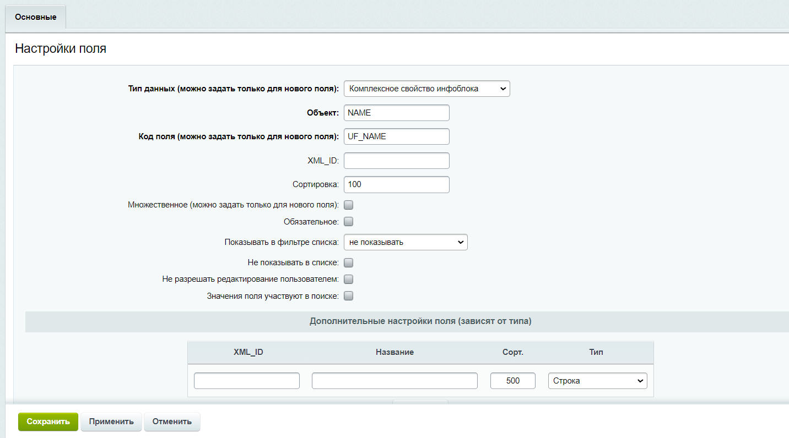

# Материалы и задание на 7 неделю

Написать свой модуль на основе "phpdevorg.cprop"  

Модуль должен добавлять для элементов инфоблока комплексное свойство

Одним из типов комплексного свойства должен быть HTML редактор, как в модуле d2mg.ufhtml  

        showHTMLEdit($code, $title, $arValue, $strHTMLControlName)

(Дополнительно, сложно) Добавить комплексное свойство для пользовательских полей  

